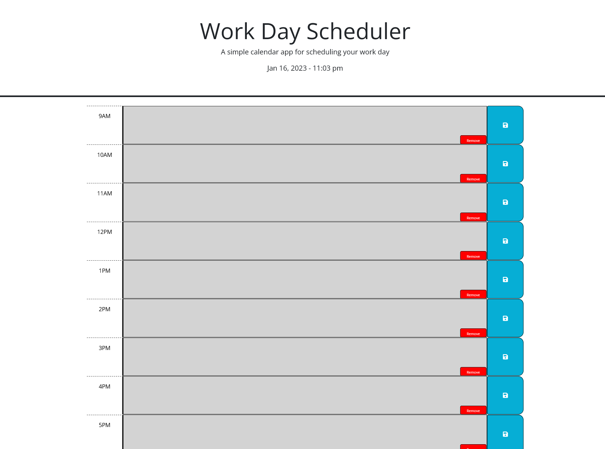

## Daily Work Scheduler

# Description

I created this application so people with busy workdays can schedule their tasks by hour, and know which tasks need to be done by color coordinated text area's based on what hour it is in the day. Building this application taught me how to work with third party API's including Day.js, jQuery and bootstrap. I also practiced my skills a little more with using local storage in javascript. 

# Installation 

N/A

# Usage

To use this application you need to simply write your tasks for the day in each text area of the coresponding hour that task needs to be complete, and click the save button. When the text area for that hour turns red, that means it is the current hour and those tasks need to be done. When the text area's color is green that means that hour is in the future, and grey means its in the past. Once you are done with that hour you can click remove and the application will remove all of your tasks for that hour. 

# Credits

GitHub link: https://github.com/CoreyDC/daily-work-scheduler

Deployed page: https://coreydc.github.io/daily-work-scheduler/